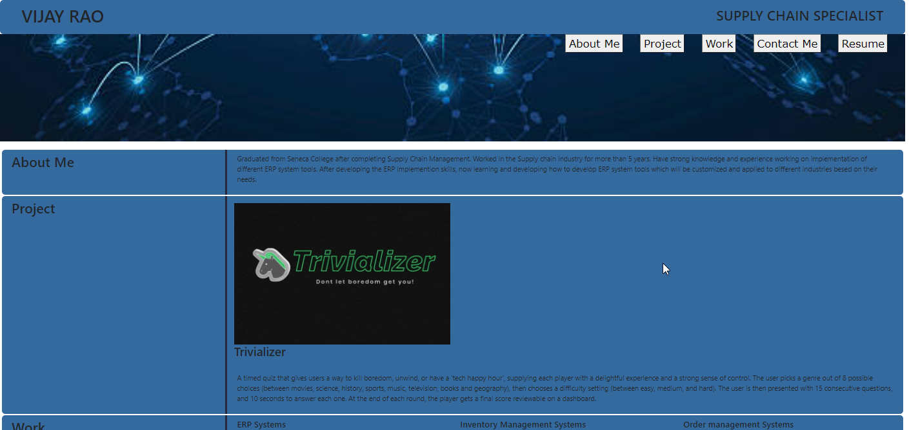

# PORTFOLIO WITH PROJECT-1

## Deployed URL for the Portfolio with Project-1
https://imvjrao.github.io/Interactive-Front-End-Project/

## Github URL for the porfolio with Project-1
https://github.com/imvjrao/Interactive-Front-End-Project.git

## Deployed URL for Project -1
https://evanab14.github.io/trivializer/

## Github URL for Project-1
https://github.com/EvanAB14/trivializer.git

## Brief Desciption - Portfolio
1. The portfolio has active links for all the Navigation tags which will take the reader to the individual sections.
2. The portfolio has been updated with the 1st Group-Project which is an "Interactive Fron End Application" - called "Trivializer.
3. Once you click of the icon image for Trivializer, the user will be directed to the application page where the user can play the trivia app using various options.

## Trivializer
1. The user can pick a genre out of 8 possible choices (between movies, science, history, sports, music, television, books and geography), and can choose a difficulty setting (between easy, medium, and hard).
2. The user is then presented with 15 consecutive questions, and 10 seconds to answer each one.
3. At the end of each round, the player gets a final score reviewable on a dashboard.
4. The application has an active link for "Contact Us" - to contact any one of the developer in case of any questions.

